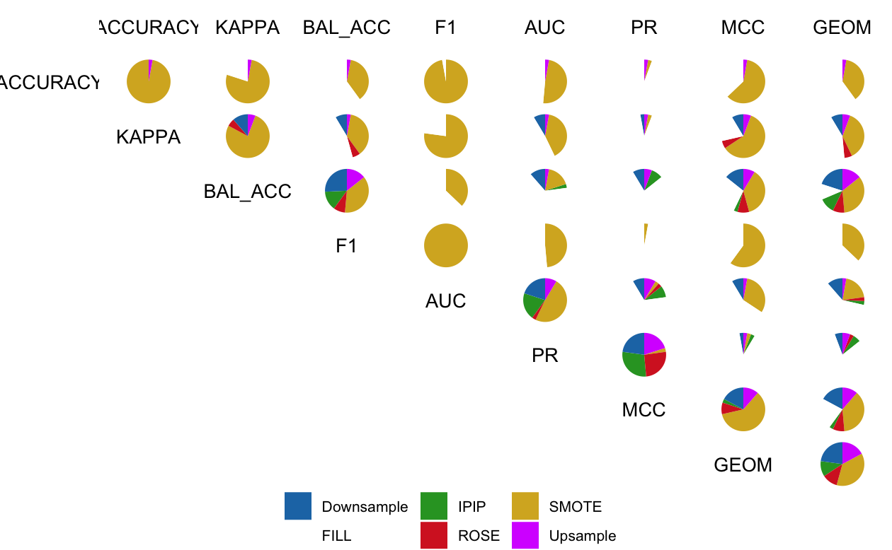

# FILM

<!-- badges: start -->
<!-- badges: end -->

## How to install FILM package

``` r
# If you don't have devtools package
install.packages("devtools")
library(devtools)

# Install FILM package 
install_github("antoniogt/FILM")
library(FILM)
```

You need the following R packages:

- readr
- data.table
- ggplot2
- stats
- DataExplorer
- MLmetrics
- DMwR
- ROSE
- dplyr
- caret

## Uses of FILM

**FILM** is an R package that performs (1) a new ensemble-based technique to deal with class imbalance for a binary classification problem which ensures that during model training all samples of the minority class have been used at least once, (2) the computation of a new metric based on an integration of a set of basic evaluation metrics from the measurement set {Accuracy, Sensitivity, Specificity, Positive Predictive Value, Negative Predictive Value, Cohen's Kappa, Balanced Accuracy, F1-Score, Area under the ROC curve, Area under the Precision-Recall curve, Mathews Correlation Coefficient, geometric mean}, so that weights are associated to each metric according to the bias they have with the minority class proportion of a particular dataset, (3) a way to represent the agreements, disagreements and win ratios of a set of models trained on a dataset in a simple way, and (4) a way to implement all of the above in a simple way using a single R function.

## Examples of use

First of all we load our dataset. A sample dataset has been provided in the 'data' folder named 'phoneme.csv'. We have to make sure that the target variable is a factor and rename it so that it does not have the values $0$ and $1$. 

``` r
# Load the data and prepare it to apply FILM() function
data<-as.data.frame(read_csv(system.file("data", "phoneme.csv", package = "FILM"),col_names=FALSE))
data$X6<-as.factor(data$X6)
levels(data$X6)<- c("one","two")

```

Once the data is prepared, we can apply the FILM() functions to obtain (1) the values of the new BAIC metric of each trained model, (2) the best model according to the BAIC value that will be the least biased by the minority class proportion of the dataset, (3) the agreement and disagreement plots of the trained model metrics along the K-fold Cross Validation and (4) all the trained models on the original dataset in case we want them for other analyses. To set the parameters of the FILM function it is recommended to ?FILM and get more information about them and their possible values.

``` r
# Apply FILM function
film <- FILM(dataset = data,formula = X6 ~ .,IAAs=c("IPIP","SMOTE","ROSE","Upsample","Downsample"),models=c("glm","ranger"), hyperparameters= expand.grid(  mtry = 1:5, min.node.size =1:3*10-9,  splitrule = "gini"))

```

An IPIP model can also be trained using the IPIP() function. See ?IPIP for help in setting the function parameters.

``` r
ipip <- IPIP(formula= X6 ~ ., dataset=data, model="ranger")
```

To obtain the BAIC metric for a particular technique one can make use of the function 'FILM(return.baic=F)' and 'BAIC()', where return.baic=F creates auxiliary datasets to the original dataframe but without computing the BAIC metric, in this case the list of metric values for all the experiments performed in the FILM methodology are returned in order to be able to perform other kind of analysis with them, while 'BAIC()' operates on the values of the metrics and computes the value of the BAIC metric. It is important to mention that in this case, to obtain the BAIC metric without applying the full FILM methodology, only a combination of the 'IAAs' and 'models' parameter can be used.

``` r
results<- FILM(dataset = data,formula = X6 ~ .,IAAs=c("IPIP"),models=c("glm"),return.baic=F)
baic<-BAIC(metrics=results$metrics,metric_values=results$metric_values,props=results$props)
```

If we have a FILM object, to obtain the values of the BAIC metric for all trained models using the combination of the 'IAAs' and 'models' parameter in the FILM() function we can also do:

``` r
film$baic_results
```

To obtain the plots of agreements and disagreements we do

``` r
plot(integrated_agree_disagree(film$all_metrics))

```

and we get a plot like the following:



## About

This package has developed by **Antonio Guillén Teruel** as part of his PhD mentored by professor **Juan Antonio Botía Blaya** and co-mentored by professor **José Tomás Palma Méndez**.

Authors: Antonio Guillén Teruel, Marcos Caracena, Jose A. Pardo, Fernando de-la-Gándara, José Palma, Juan A. Botía
